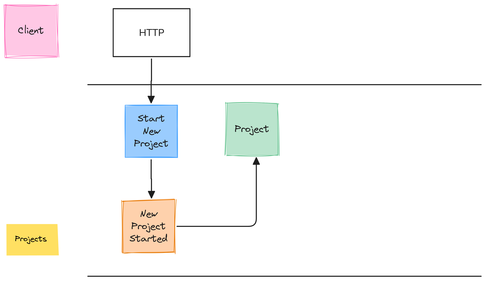
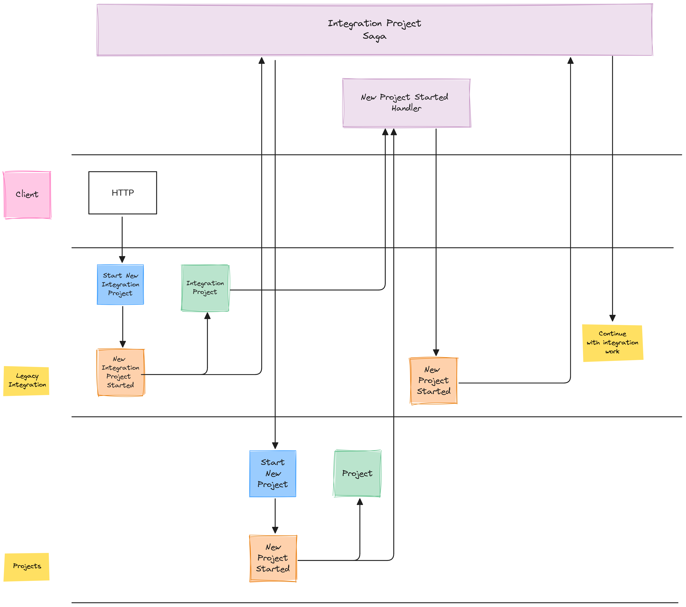

#  Starting Saga Conditionally

In this experiment (.NET solution `StartSagaConditional`), projects can be created using "modern" system (.NET project `Projects`). 

The event model looks like this:

In addition, there needs to be a way to start a new project from the "legacy" integration (.NET Project `LegacyIntegration`) without modifying the "modern" codebase to be aware of the legacy code.

The event model looks like this:

The key element is to have a duplicate of the `Projects/NewProjectStarted`) event in `LegacyIntegration`. The original event is consumed by the `NewProjectStartedHandler` inside `LegacyIntegration`.

If the handler finds a `LegacyIntegrationProject` projection, it will publish `NewProjectStarted` and the saga with the Integration Project's Id will continue.

`LegacyIntegrationProject` is only created if a `StartNewIntegrationProject` command has been issued and the `NewIntegrationProjectStarted` has been persisted and published afterwards.
